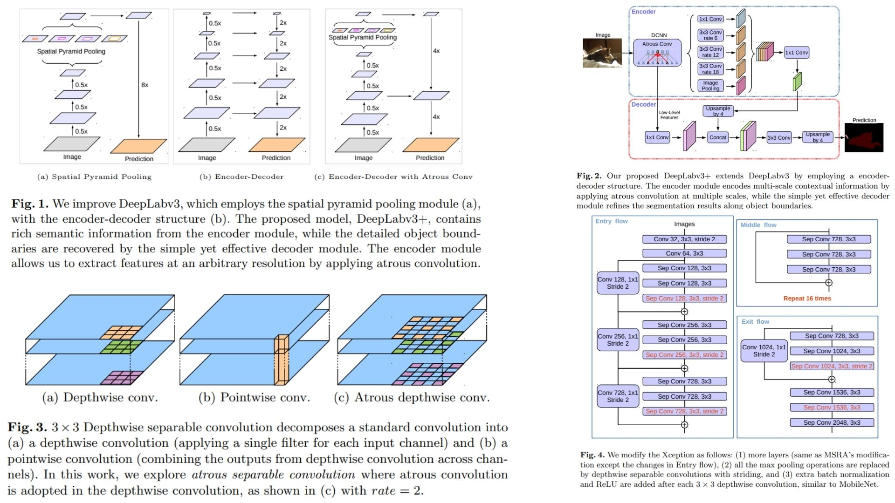

# 🔬 DeepLabv3+ — Encoder-Decoder Architecture for Semantic Segmentation

This repository provides a **faithful Python replication** of **DeepLabv3+** for 2D semantic image segmentation.  
It implements the pipeline described in the original paper, including **Atrous Spatial Pyramid Pooling (ASPP), modified Xception backbone, and a simple decoder for boundary refinement**.

Paper reference: *[Encoder-Decoder with Atrous Separable Convolution for Semantic Image Segmentation](https://arxiv.org/abs/1802.02611)*  

---

## Overview ✨



> DeepLabv3+ extends DeepLabv3 by employing an **encoder-decoder structure**. The encoder captures **multi-scale context** via atrous convolutions, while the decoder refines segmentation results along **object boundaries**.

Key points:

* **Backbone (Modified Xception)** extracts hierarchical features $$F_i$$  
* **Atrous Convolutions** control receptive field at multiple scales $$A_i$$  
* **ASPP module** captures multi-scale context $$C_i$$ with rates $$[6,12,18]$$  
* **Decoder** fuses low-level features $$L_i$$ to refine segmentation along boundaries  
* **Segmentation head** outputs logits $$\hat{Y}$$  
* **Final output** is upsampled by 4× to match input resolution $$\hat{Y}_{final} = Upsample(\hat{Y}, scale=4)$$  

---

## Core Math 📐

**Encoder output (multi-scale features via ASPP):**

$$
C_i = \text{ASPP}(F_i) = \text{Concat}(Conv_{1x1}(F_i), Conv_{3x3}^{rate=6}(F_i), Conv_{3x3}^{rate=12}(F_i), Conv_{3x3}^{rate=18}(F_i), ImagePool(F_i))
$$

**Decoder refinement:**

$$
D_i = ReLU(BN(Conv(Up(D_{i+1}) \oplus L_i)))
$$

Where $$Up()$$ is 4× bilinear upsampling, $$L_i$$ are low-level features, and $$\oplus$$ denotes concatenation.

**Final segmentation output:**

$$
\hat{Y}_{final} = Upsample(\hat{Y}, scale=4)
$$

**Segmentation loss** (cross-entropy):

$$
\mathcal{L} = \text{CE}(\hat{Y}_{final}, Y)
$$

---

## Why DeepLabv3+ Matters 🌿

* Uses **modified Xception backbone** for efficient feature extraction 🧠  
* Captures **multi-scale context** via **Atrous Convolutions & ASPP** 🌐  
* **Decoder** refines boundaries for accurate segmentation 🎯  
* Produces **high-quality masks** for complex scenes 🖼️  

---

## Repository Structure 🏗️

```bash
DeepLabv3Plus-Replication/
├── src/
│   ├── blocks/                          
│   │   ├── atrous_conv.py       # Atrous (dilated) convolution
│   │   ├── depthwise_sep.py     # Depthwise Separable Conv
│   │   ├── aspp.py              # ASPP module (rates 6,12,18 + image pooling)
│   │   └── upsample.py          # Bilinear upsampling
│   │
│   ├── backbone/
│   │   └── xception.py          # Modified Aligned Xception
│   │
│   ├── encoder/
│   │   └── encoder.py           # Backbone + Atrous + ASPP
│   │
│   ├── decoder/
│   │   └── decoder.py           # Low-level concat + refinement conv
│   │
│   ├── head/
│   │   └── segmentation_head.py # 1x1 Conv logits
│   │
│   ├── model/
│   │   └── deeplabv3plus.py     # Full DeepLabv3+ pipeline
│   │
│   └── config.py                # output_stride, rates, channels
│
├── images/
│   └── figmix.jpg               
│
├── requirements.txt
└── README.md
```

---

## 🔗 Feedback

For questions or feedback, contact:  
[barkin.adiguzel@gmail.com](mailto:barkin.adiguzel@gmail.com)
